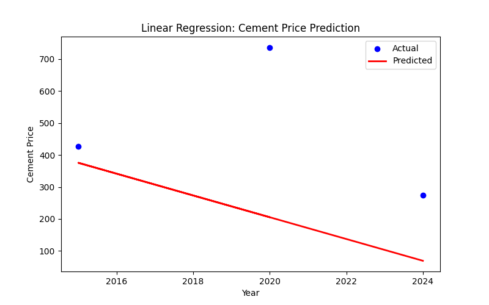
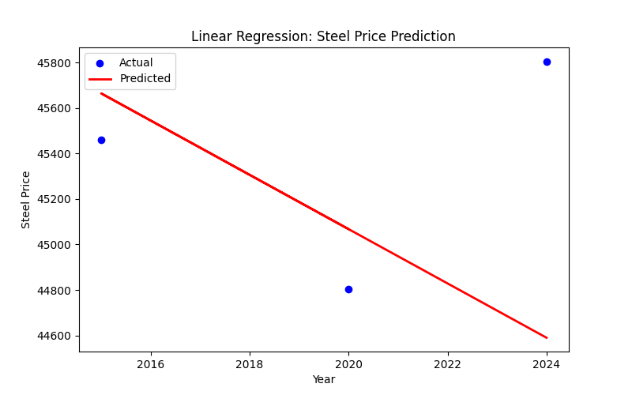
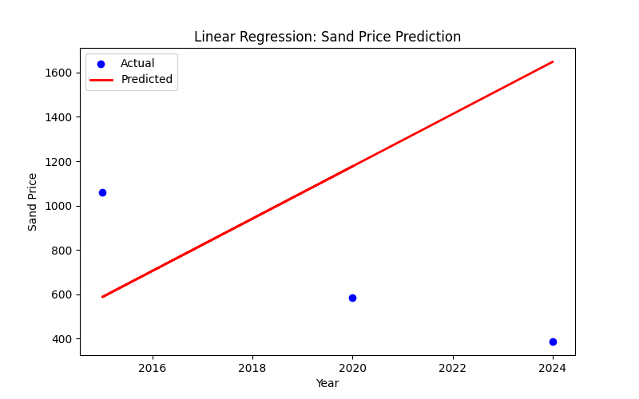
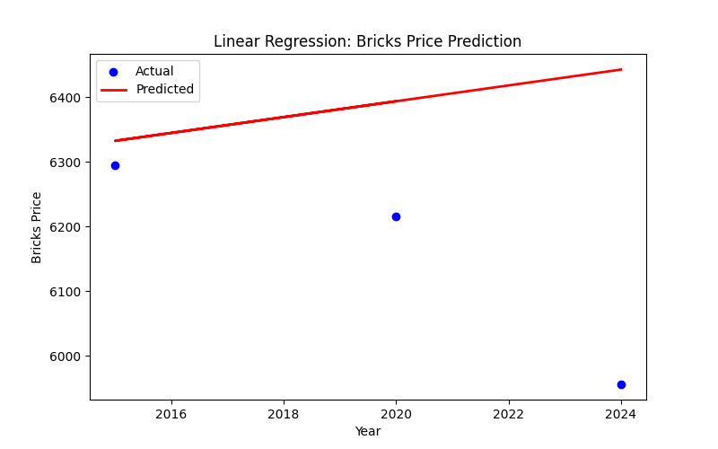
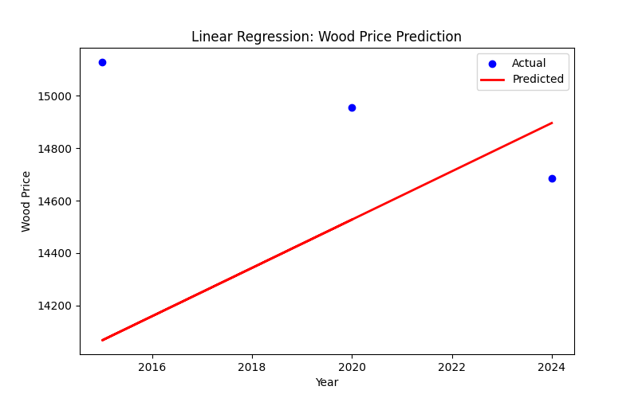

# Construction Material Price Predictor

# Overview
This project predicts future prices of construction materials (like cement, steel, sand) using Machine Learning.

# Project Structure
- `data/` → dataset files
- `notebooks/` → Jupyter notebooks
- `src/` → Python scripts
- `results/` → model results & graphs

# Tech Stack
- Python, Pandas, NumPy
- Scikit-learn
- Matplotlib, Seaborn
- Jupyter Notebook

# Workflow
1. Data collection & cleaning
2. Exploratory Data Analysis (EDA)
3. Machine Learning models (Linear Regression, Random Forest, etc.)
4. Model evaluation (R², MAE, RMSE)

# Results

Predictions and evaluation metrics for construction material prices:

| Material | R² Score | MAE   | RMSE  | Plot |
|----------|----------|-------|-------|------|
| Cement   | -1.95    | 262.60 | 330.41 |  |
| Steel    | -2.08    | 561.29 | 728.00 |  |
| Sand     | -8.07    | 774.32 | 848.20 |  |
| Bricks   | -3.33    | 234.06 | 299.39 |  |
| Wood     | -12.55   | 566.65 | 672.28 |  |

